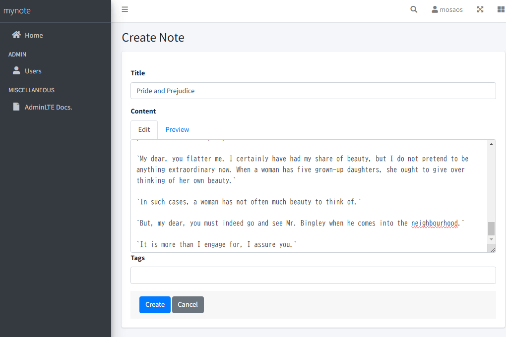
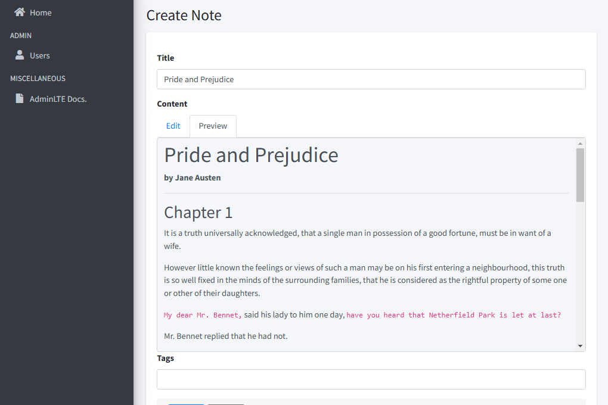
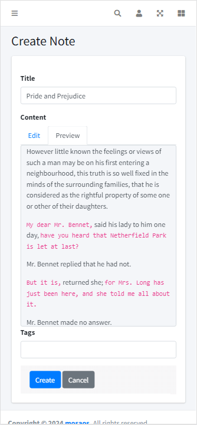
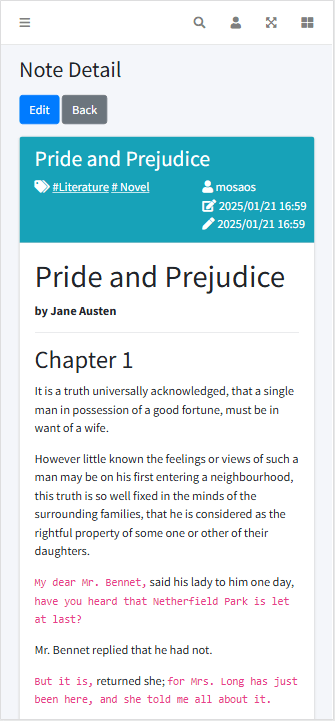

# Servlet sample

Servlet sample application

## Overview

This is an app for taking simple notes.  
It supports Markdown format (only).

- For **`learning Servlet`**.  
- The view uses Thymeleaf instead of JSP.
- Not at the product level. Validation etc. are quite sloppy.   
- Registration of assets such as image files is not supported.
- UI supports Japanese and English. The language can be changed using the browser's language settings.

## System Requirement

- Java : Java 17
- DB : MariaDB 10 ( or MySQL )
- Tomcat : Tomcat 10

I confirmed that it works with [Pleiades All in One](https://willbrains.jp/) 2023.

## Setup

### Database

Please create an appropriate database on mariadb or mysql.

### Initialization SQL

Execute the following SQL in the root for the created database.

- **init-function.sql**  
There is no need to run this for `MySQL 8 or later`.  
It creates UUID related functions (`BIN_TO_UUID`, `UUID_TO_BIN`).  
For MariaDB, these functions do not exist, so you need to create them.
す。  
The above functions are used in the app.
- **init.sql**  
It create tables and input initial data.

### application.properties

Edit `application.properties`.

### Build

The following command will generate a war file.

```shell
mvn package
```

`servlet-sample-0.0.1-SNAPSHOT.war` is generated under the `target` directory.

### Deploy

Deploy generated war file to Apache Tomcat.

### id / password

You can log in with id = `admin`, password = `admin`.  
You can change the password from the user list screen.

## Screenshots





　

## Docker / docker compose

You can use docker compose.

Run the following in project root:

```shell
docker compose up -d
````