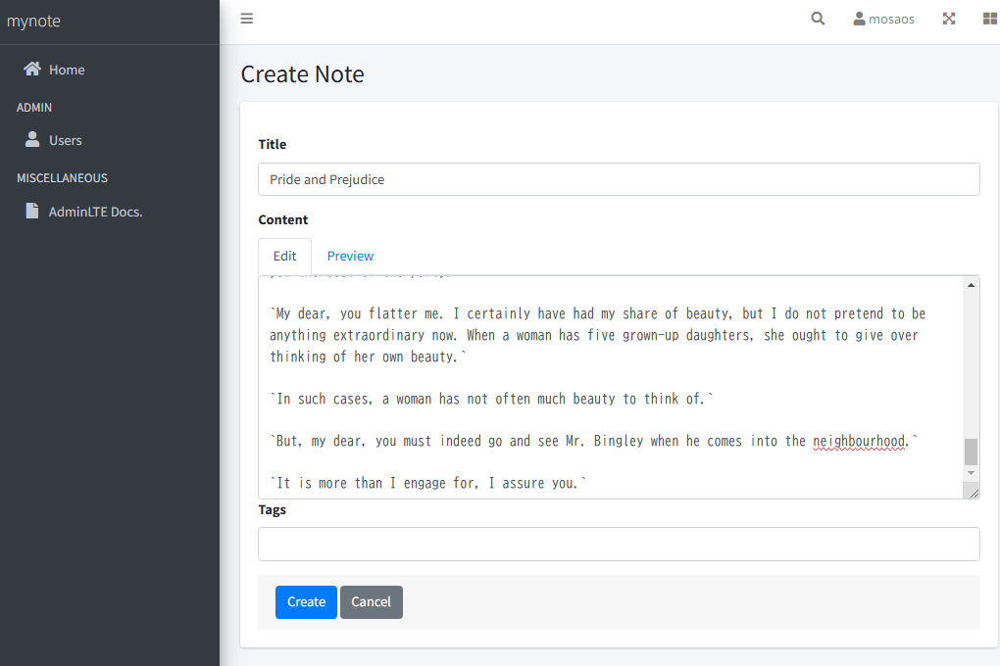
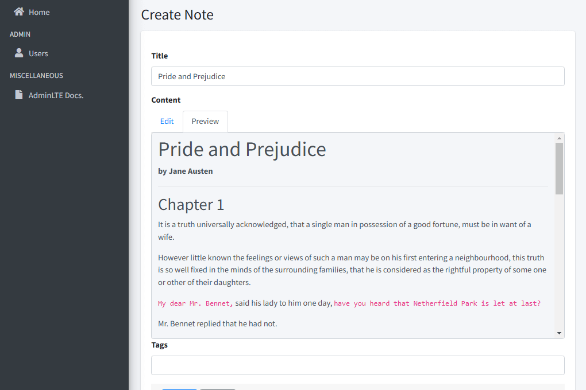
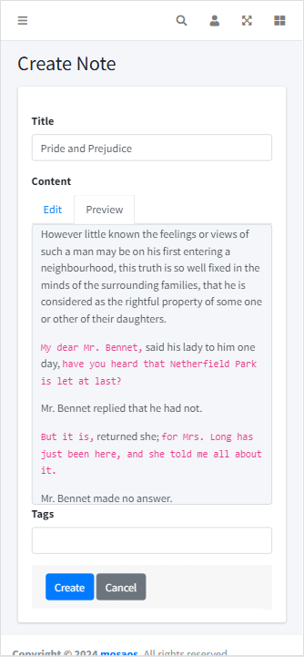
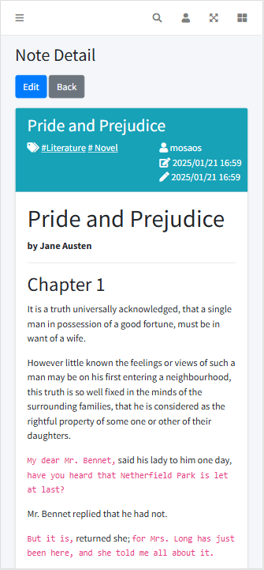

# Servlet sample

サーブレットを利用した実装サンプル。

## 概要

簡単なメモアプリです。  
メモのフォーマットは Markdown 形式 ( のみ ) をサポートしています。

- Servlet 学習用です。  
- ビューは JSP ではなく Thymeleaf を利用しています。
- プロダクトレベルではありません。バリデーション等はかなり手を抜いています。  
- 画像ファイル等のアセットの登録はサポートしていません。
- UIは日英対応。ブラウザの言語設定で切り替わります。

## System Requirement

- Java : Java 17
- DB : MariaDB 10 ( or MySQL )
- Tomcat : Tomcat 10

[Pleiades All in One](https://willbrains.jp/) 2023 環境 ( xampp 含む ) があれば実行可能です。

## セットアップ

### データベースの作成

適当なデータベースを作成して下さい。

### 初期化用 SQL の実行

作成したデータベースに対して、ルートディレクトリにある以下 SQL を実行して下さい。

- **init-function.sql**  
MySQL 8 以降の場合には実行の必要はありません。  
UUID関連ファンクション ( `BIN_TO_UUID`、`UUID_TO_BIN` ) の作成を行っています。  
MariaDB の場合これらファンクションが無いため作成する必要があります。  
※ 上記ファンクションをアプリで利用しています。  
- **init.sql**  
テーブル生成、及び、初期データの投入を行っています。

### application.properties

`application.properties` を環境にあわせて編集してください。

### Build

以下コマンドで war ファイルを生成します。

```shell
mvn package
```

`servlet-sample-0.0.1-SNAPSHOT.war` が `target` ディレクトリ下に生成されます。

### Deploy

生成された war ファイルを Apache Tomcat にデプロイします。

### id / password

id = `admin`, password = `admin` でログイン可能です。ユーザ一覧画面からパスワード変更が可能です。

## スクリーンショット





　

## Docker / docker compose

docker compose を使用できます。

プロジェクトのルートで以下を実行してください。

```shell
docker compose up -d
````